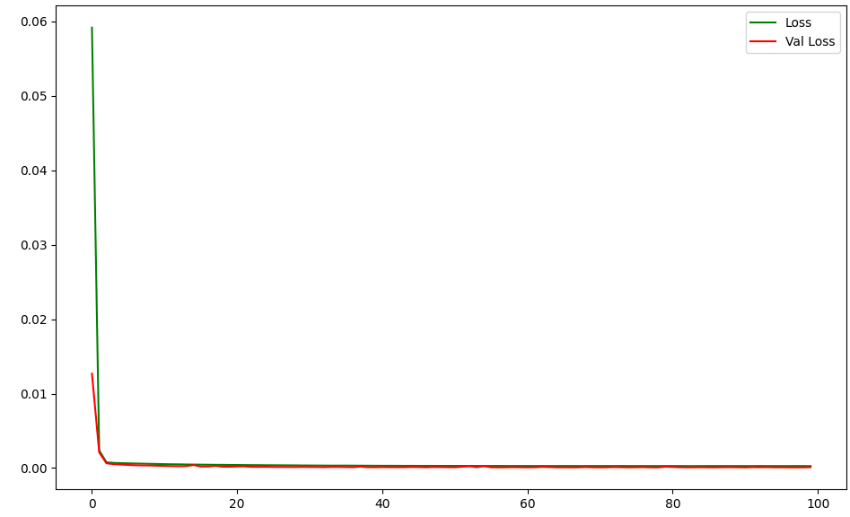
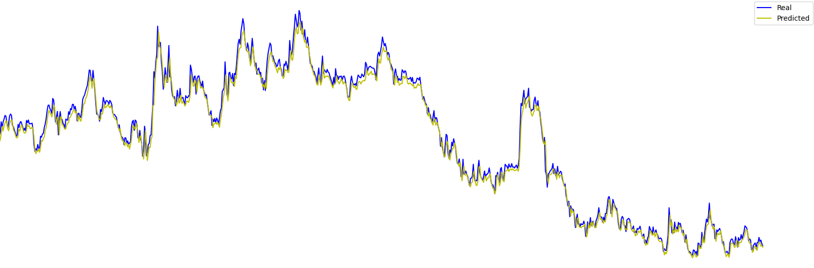

# Euro price prediction

The project involves predicting the closing price of the Euro in PLN. The Euro exchange rate is retrieved from the `yfinance` library and base on 5 columns ['Close',Open',Low',High','Adj Close'] and the values for these columns from the last 20 days, the price for the next day is predicted. 

Using twilio library and its API, a daily SMS with the predicted Euro price is sent at 
a given time. 

## Tech Stack

**Libraries:** PyTorch, pandas, NumPy, Matplotlib, yfinance, twilio, scikit-learn

## Model Architecture
The LSTM model consists of:

 - LSTM layer with customizable input_size, hidden_size, and number of layers
 - Fully connected layer that outputs the final prediction

## Model results

#### For model with 6 hidden_size and 1 stacked layers

### Loss and test Loss : 

### Predictions for test dataset : 

# Summary 

For training the model, 5,799 samples were used, which were split into 80% for training data and 20% for testing data. The model was then trained for 100 epochs, after which it achieved a loss of 0.0003 and an R² score of 0.990.